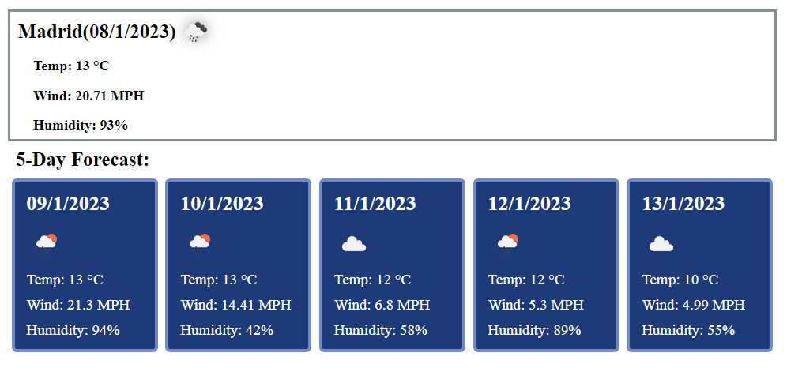
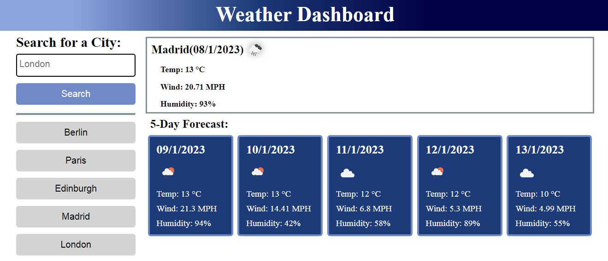

# 08 Server-Side APIs: Weather Dashboard

## The application for quickly searching the weather of different cities
 
### What problem does it solve?

```
This page can be used to find the weather for the current day and the next 5 days.
```

### What can you learn, creating it?

* How to structure weather data on page using HTML+CSS.
* How to get weather data from apiUrl
* How to use diffrent "Date format"
* How to create and store "search history"
* How to create simple grid for putting blocks top, left, bottom and right.
* How to style paragraphs, headers, buttons, size and positions of images.
* How to add few icons.

### The structure 

* The Weather Dashboard webpage includes a header.

* Also webpage includes area for seach, and history buttons.
![Also webpage includes area for seach, and history buttons.]
(assets/search.png)
* You can press on button and get weather result.


### View

The following image shows the web application's appearance and functionality:


